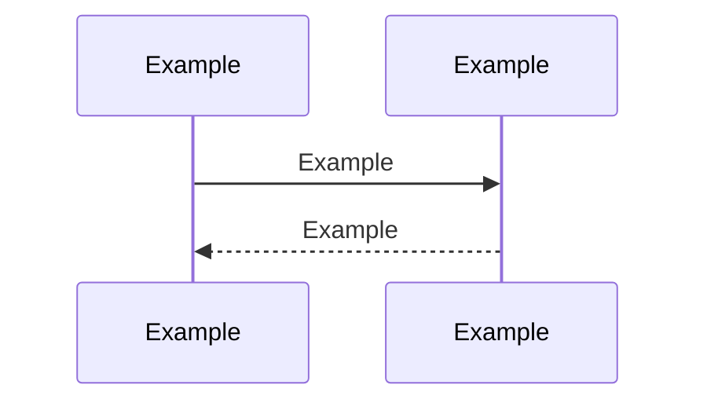

# Example — Technical Design

## Purpose

Example

## Requirements Addressed

| Requirement | How it is addressed | Section |
|-------------|---------------------|---------|
| Example | Example | Example |

**Out of scope:** Example

## Proposed Solution

Example

## Architecture

| Component | Repository / module | Change | Responsibility |
|-----------|---------------------|--------|----------------|
| Example | Example | Example | Example |

## Data Changes

Example

## API Changes

| Endpoint / contract | Change | Backward compatible? |
|---------------------|--------|----------------------|
| Example | Example | Example |

## Failure Scenarios

| Scenario | Detection | System behaviour | User impact |
|----------|-----------|------------------|-------------|
| Example | Example | Example | Example |

## Security Considerations

| Threat / concern | Mitigation |
|------------------|------------|
| Example | Example |

## Observability

| Signal | Name | Purpose | Alert threshold |
|--------|------|---------|-----------------|
| Example | Example | Example | Example |

## Alternatives Considered

| Option | Pros | Cons | Why not chosen |
|--------|------|------|----------------|
| Example | Example | Example | Example |

## Testing Strategy

| Level | What is tested | Tooling |
|-------|----------------|---------|
| Unit | Example | Example |
| Integration | Example | Example |

## Rollout and Migration

1. Example

**Rollback:** Example

## Open Questions

| # | Question | Owner | Due | Blocking? |
|---|----------|-------|-----|-----------|
| Q1 | Example | Example | Example | Example |

<!-- relations:start — generated from the front matter by the platform; do not edit -->
## Relations

- **Satisfies:** [[PRD-002-expose-the-running-build-version|PRD-002 · Expose the Running Build Version]]
- **Depends on:** [[ADR-001-technical-design-expose-the-running-build-version-decision|ADR-001 · Technical Design: Expose the running build version decision]]
<!-- relations:end -->
