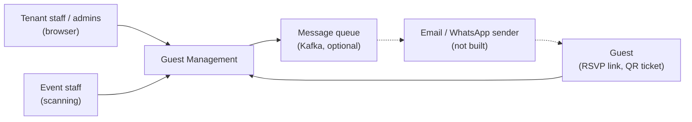
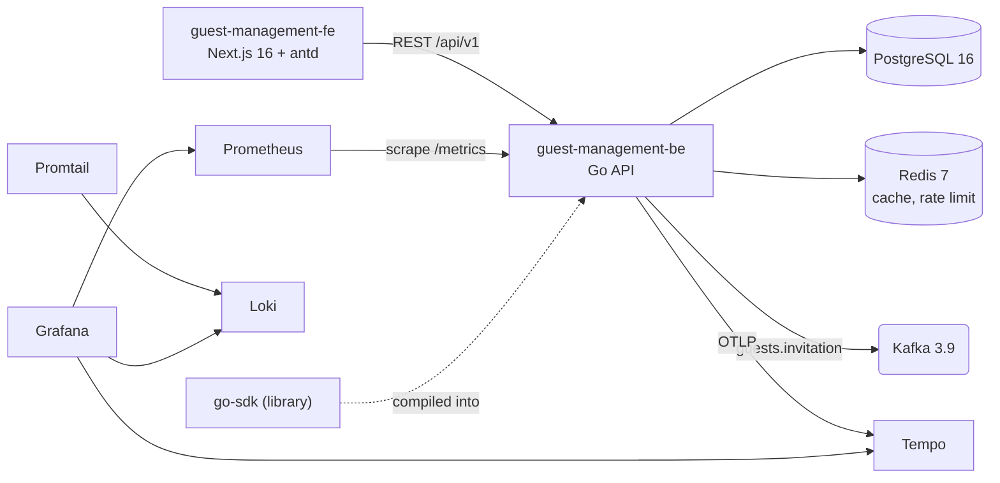

# Guest Management — Architecture Overview

<!--
Extracted on 2026-09-17 from guest-management-be (AGENTS.md, docs/ARCHITECTURE.md, CONFIGURATION.md,
cmd/api/main.go, configs/config.yaml, docker-compose.yaml) and guest-management-fe (package.json, docs/DESIGN_SYSTEM.md).
Repository-level coding rules stay in each repository's AGENTS.md; this document is the system view.
-->

## Introduction and Goals

**Purpose:** A multi-tenant platform for event organisers to manage guests, invitations and RSVPs, QR tickets, and check-in through workflow steps, with role-based staff access (see PRD-001).

| Priority | Quality goal | Motivation |
|----------|--------------|------------|
| 1 | Tenant data isolation and security | Tenants are separate organisations holding guests' personal data (ADR-002, ADR-005) |
| 2 | Correct check-in | Entitlements and single-use steps must hold under load at the door (ADR-004, ADR-007) |
| 3 | Maintainability and extractability | One developer working with AI agents; `scans` may become its own service (ADR-001) |
| 4 | Operability | Real readiness checks, graceful shutdown, metrics, traces, structured logs |

## Constraints

| Constraint | Type | Explanation |
|------------|------|-------------|
| Go 1.25, chi, PostgreSQL, Redis | Technical | Existing stack; only chi, google/uuid, and lib/pq are allowed as extra third-party libraries in the app |
| Built on the owner's `go-sdk` | Technical | Cross-cutting capabilities belong in `go-sdk` (httpkit, errorz, repository, sqlkit, auth, crypto, queue, …). It is consumed through tagged versions (`v0.1.0`, ADR-010) |
| Next.js 16, React 19, Ant Design 6, Tailwind 4, bun | Technical | Frontend stack. Next.js 16 has breaking changes, so agents must read `node_modules/next/dist/docs/` first (guest-management-fe AGENTS.md) |
| One developer | Organisational | Personal project with no client. AI agents do most implementation |
| `make check` must pass | Organisational | This is the backend's Definition of Done |
| Guest PII encrypted at rest | Legal / privacy | REQUIREMENT.md §5.4 |

## System Context

| Actor / external system | Interaction | Protocol |
|-------------------------|-------------|----------|
| Tenant staff and admins | Manage users, events, guests, templates, and staff | HTTPS, JSON, Bearer JWT |
| Event staff | Record scans and read scan history | HTTPS, JSON, Bearer JWT |
| Guest | Confirm or decline an RSVP using the invitation token (no account) | HTTPS, JSON, public route |
| Kafka | Receives `guests.invitation` messages | Kafka protocol (`QUEUE_BACKEND=kafka`); the default is `noop` |
| Email / WhatsApp sender | Would consume queue messages and deliver them using `message_templates` | Not built (PRD-001 Q6) |

## Container View

| Container | Technology | Responsibility | Repository |
|-----------|------------|----------------|------------|
| Web app | Next.js 16 (App Router), React 19, Ant Design 6, Tailwind 4, bun | Staff UI. Today: login, forced password change, user list/detail/create, and a public marketing shell, all on mock data | `guest-management-fe` (github.com/biairmal/guest-management-fe) |
| API | Go 1.25, chi, go-sdk | REST API `/api/v1`, `/health`, `/ready`, `/metrics`, and `/swagger` (Basic Auth) | `guest-management-be` (github.com/biairmal/guest-management-be) |
| PII CLI | Go (`cmd/piicli`) | Encrypts, decrypts, or hashes a single value for manual database work | `guest-management-be` |
| Shared library | Go module `github.com/biairmal/go-sdk` (+ `mocks` module) | httpkit, errorz, logger, config, repository, sqlkit, redis, auth, crypto, kafka/queue, lifecycle, metrics, tracer, ratelimit, circuitbreaker, validator | `go-sdk` (github.com/biairmal/go-sdk) |
| Database | PostgreSQL 16 (13+ supported) | System of record, migrated with golang-migrate (19 migrations) | Migrations in `guest-management-be/migrations` |
| Cache | Redis 7 | Read-through caching of repositories and role permissions; optional rate-limit backend | — |
| Queue | Kafka 3.9 (local compose) | Invitation messages | — |
| Observability | Tempo, Prometheus, Loki, Promtail, Grafana | Traces, metrics, logs (local compose) | `guest-management-be/docker` |

## Key Components

| Component | Container | Responsibility |
|-----------|-----------|----------------|
| `cmd/api` | API | Loads config, builds dependencies and the router, and runs the server lifecycle. Middleware order: Metrics → Recover → RequestID → Correlation → Tracing → Logging → RateLimit → Auth |
| `internal/app` | API | Composition root: repositories → services → handlers → routes |
| `internal/config` | API | Root `Config` embedding go-sdk configs plus `app.<feature>.<layer>` sections |
| `internal/core/audit` | API | Soft-delete and timestamp repository decorator (ADR-007) |
| `internal/core/repository` | API | `NewRepository` / `NewRepositoryNoAudit` plus optional Redis cache decorator |
| `internal/core/query` | API | List parsing against an allow-list, `field;operator` filters (`eq`, `like`), `ToListOptions`, `ValidateListParams` |
| `internal/core/authz` | API | `Checker`, `RequirePermission`, claim readers (tenant, role, user), and the event-scoped fallback (ADR-004) |
| `internal/core/validation` | API | Request validation through struct tags |
| `features/auth` | API | Login and refresh token pair (ADR-003) |
| `features/tenants`, `features/users` | API | Tenant CRUD; user CRUD, password flows, master transfer (ADR-009) |
| `features/roles` | API | Roles, permissions, cached role→permission lookup (no HTTP) |
| `features/events` (`category`, `event`, `workflowstep`, `workflowsteptemplate`) | API | Categories, events with template seeding (ADR-008), workflow steps with sync |
| `features/templates` | API | Message templates for email and WhatsApp |
| `features/staffing` | API | Event staff assignments; event-role resolver |
| `features/tickets` (`tickettype`, `tickettypetemplate`) | API | Ticket types, their step entitlements, category ticket templates |
| `features/guests` | API | Guests, invitations, public RSVP, QR tickets, PII encryption (ADR-005), invitation publisher (ADR-006) |
| `features/scans` | API | Record a scan (7-step validation), scan history |
| `app/_components/AppShell` | Web app | Collapsible sider with multi-level navigation (Dashboard, Events › Transactions / Configuration › Category / Ticket Template, Guests, Staff, Incidents, Templates, Users, Workflow steps), header avatar menu |
| `app/_lib/theme`, `ThemeModeProvider` | Web app | Light and dark theme tokens (DESIGN_SYSTEM.md §1) |

## Data and Integrations

The API owns all data in one PostgreSQL database (see DB-001). The web app holds no data of its own.

| Integration | Direction | Format | Frequency | Failure handling |
|-------------|-----------|--------|-----------|------------------|
| Web app → API | In | JSON over HTTPS, envelope `{code, message, timestamp, data \| error}` | Real-time | Not integrated yet. The planned approach is to refresh the token on 401 (UX-001) |
| API → Kafka `guests.invitation` | Out | JSON `InvitationMessage`, key `guest_id` | Per invitation | Best-effort; failures are logged and not retried (ADR-006) |
| API → Redis | Out | Cached JSON entities and permission lists | Per read | A cache miss or outage falls back to the database |
| Prometheus → API `/metrics` | In | Prometheus text | Scrape interval | Endpoint mounted only when `METRICS_ENABLED` |
| API → Tempo | Out | OTLP gRPC | Per request | Only when `TRACING_ENABLED` (off by default) |

## Deployment View

Only a local development setup exists. No staging or production environments are defined (PRD-001 Q9).

| Environment | Hosting | URL / region | Notes |
|-------------|---------|--------------|-------|
| Local development | Developer machine; `docker compose up -d` in `guest-management-be` (postgres, redis, redisinsight, kafka, kafka-ui, tempo, prometheus, loki, promtail, grafana) | API `127.0.0.1:8080`, web app `localhost:3000` | Migrations: `make migration-up`. Frontend: `bun dev` |
| Staging | Not defined | Not defined | — |
| Production | Not defined | Not defined | — |

There is no CI pipeline in either repository yet. The backend runs `make check` locally.

## Cross-Cutting Concerns

| Concern | Approach |
|---------|----------|
| Authentication | HS256 JWT access and refresh tokens; every route is protected unless listed as public in `auth.token.rules` (ADR-003) |
| Authorization | Permission middleware per route group, with an event-scoped fallback (ADR-004); tenant taken from the token (ADR-002, partly rolled out) |
| Tenant isolation | Checked in services; cross-tenant or cross-parent ids return 404 |
| Logging and monitoring | go-sdk structured logger with `request_id` and `correlation_id`; Prometheus metrics; OpenTelemetry tracing; `/health` and `/ready` (database and Redis ping, and 503 while draining) |
| Error handling | `errorz` codes in every layer, mapped to HTTP status by httpkit; services translate repository errors |
| Validation | Shape rules as struct tags checked at the HTTP boundary; business rules in services; list allow-lists enforced in both places |
| Configuration and secrets | `configs/config.yaml` with `${VAR:default}` substitution, and `.env` (not committed). Secret names: `DATABASE_PASSWORD`, `REDIS_PASSWORD`, `AUTH_HS256_SECRET`, `GUEST_PII_ENCRYPTION_KEY`, `GUEST_PII_BLIND_INDEX_KEY`, `SWAGGER_USERNAME`/`SWAGGER_PASSWORD`, `QUEUE_KAFKA_AUTH_*` |
| Rate limiting | Per IP, in memory by default (10 requests/s, burst 20) or in Redis |
| Resilience | go-sdk lifecycle graceful shutdown (drain delay, then closing tracer, Redis, and database); circuit breaker available but unused because there are no outbound HTTP calls |
| API documentation | Swagger generated from handler annotations (`make swagger-generate`), served at `/swagger` behind Basic Auth |
| Testing | Standard-library table-driven tests with generated gomock mocks (`*__test.go`); no integration or end-to-end tests yet |
| UI theming | Direction D "Full Dark Elevated" light and dark token pairs; IBM Plex Sans and Mono; indigo `#4F46E5` primary, teal accent (DESIGN_SYSTEM.md) |

## Quality Attributes

| Attribute | Scenario | Target |
|-----------|----------|--------|
| Security | A Tenant Staff user of tenant A requests an event id of tenant B on a permission-gated route | 404; no data returned |
| Correctness | The same ticket is scanned twice at a single-use step | Second scan returns 409; exactly one `scan_logs` row |
| Availability | PostgreSQL goes down | `/ready` returns 503 within one probe; `/health` stays 200 |
| Operability | SIGTERM during traffic | `/ready` turns 503, in-flight requests drain, resources close in order |
| Performance | Peak check-in at the door | Target not defined (PRD-001 Q1) |
| Privacy | Database dump | No plaintext guest email or phone |

## Architecture Decisions

| ADR | Decision | Status |
|-----|----------|--------|
| ADR-001 | Feature-sliced modular monolith on go-sdk | Draft (in effect) |
| ADR-002 | Tenant isolation in the application layer, tenant from the token, 404 for cross-tenant access | Draft (partly rolled out) |
| ADR-003 | Stateless HS256 access and refresh JWTs | Draft (in effect) |
| ADR-004 | One role engine with system and event scopes and an event fallback | Draft (in effect) |
| ADR-005 | AES-GCM guest PII with an HMAC blind index | Draft (in effect) |
| ADR-006 | Invitations through a queue abstraction | Draft (in effect) |
| ADR-007 | Soft delete; append-only scan logs | Draft (in effect) |
| ADR-008 | Copy category templates into new events in one transaction | Draft (in effect) |
| ADR-009 | Separate `/me` and admin routes | Draft (in effect) |
| ADR-010 | Consume go-sdk through release and development tags | Draft (decided, not yet applied) |

"Draft (in effect)" means the decision is already implemented but has not yet been approved in AI Empire.

## Risks and Technical Debt

| Item | Type | Impact | Plan |
|------|------|--------|------|
| `tenants`, `event-categories`, `events`, `workflow-steps`, `workflow-step-templates`, and `message-templates` require only a login; `events` takes `tenant_id` from the body | Risk (security) | High: data can be read or changed across tenants | Add permission gates and take the tenant from the token (PRD-001 Q4) |
| `replace => ../go-sdk` in `go.mod` (resolved) | Risk (tooling) | Was high: AI Empire worktrees and CI could not resolve `../go-sdk` | Resolved 2026-09-17 (ADR-010): `go-sdk` tagged `v0.1.0`, `replace` removed |
| No CI in any repository | Debt | Medium | Add a GitHub Actions workflow running `make check`, and `bun run lint` plus `bun run build` |
| No integration or end-to-end tests; the frontend has no tests | Debt | Medium | Postman/newman end-to-end tests are planned (tester agent); add `*_integration_test.go` for transactions |
| No import-boundary lint rule | Debt | Low | Consider depguard rules for cross-feature imports |
| Non-transactional workflow-step sync, ticket-type step replacement, and scan duplicate check | Risk | Low to medium | Add transactions or a partial unique index if collisions are reported |
| Stateless tokens with no revocation | Risk | Medium | Decide before production (ADR-003) |
| No `GET /roles` endpoint; no `name` on users | Debt | Blocks frontend work | Backend follow-up (PRD-001 Q3) |
| Stale repository docs: API_CONTRACT.md (2026-09-01, missing B7–B12), TESTING.md ("zero tests"), DATABASE.md (`must_change_password` note), AGENTS.md Definition of Done (`serializer.ParseJSON`, reversed in A8) | Debt | Low | Treat API-001 and DB-001 plus Swagger as current; fix or retire the stale files |
## Glossary

| Term | Definition |
|------|------------|
| Feature slice | A self-contained package `internal/features/<feature>` with model, repository, service, handler, and routes |
| Composition root | `internal/app`, the only package that wires all features together |
| `errorz` | go-sdk's structured error type with transport-independent codes |
| Blind index | A deterministic keyed hash used to search encrypted values by exact match |
| Direction D | The chosen UI theme: elevation expressed by stepped surface colours rather than shadows |

<!-- relations:start — generated from the front matter by the platform; do not edit -->
## Relations

- **Depends on:** [[ADR-001-build-a-feature-sliced-modular-monolith-on-go-sdk|ADR-001 · Build the backend as a feature-sliced modular monolith on go-sdk]], [[ADR-002-enforce-tenant-isolation-in-the-application-layer|ADR-002 · Enforce tenant isolation in the application layer using the token's tenant claim]], [[ADR-003-use-stateless-access-and-refresh-jwts|ADR-003 · Use stateless HS256 access and refresh JWTs without server-side revocation]], [[ADR-004-use-one-role-engine-with-system-and-event-scopes|ADR-004 · Use one role and permission engine with system and event scopes and an event-scoped fallback]], [[ADR-005-encrypt-guest-contact-data-with-a-blind-index|ADR-005 · Encrypt guest email and phone at rest with AES-256-GCM and search them through an HMAC blind index]], [[ADR-006-publish-invitations-through-a-queue-abstraction|ADR-006 · Publish invitations through a queue abstraction instead of sending messages directly]], [[ADR-007-soft-delete-entities-and-keep-scan-logs-append-only|ADR-007 · Soft-delete domain entities and keep scan logs append-only]], [[ADR-008-seed-events-from-category-templates-in-one-transaction|ADR-008 · Seed new events from category templates by copying them in one transaction]], [[ADR-009-separate-self-service-me-routes-from-admin-routes|ADR-009 · Separate self-service /me routes from admin routes]], [[ADR-010-consume-go-sdk-through-release-and-development-tags|ADR-010 · Consume go-sdk through tagged versions, with separate development and release tags]]
- **Documents:** [[PRD-001-guest-management-platform|PRD-001 · Guest Management Platform]]
- **References:** [[API-001-guest-management-api-specification|API-001 · Guest Management REST API — API Specification]], [[DB-001-guest-management-database-design|DB-001 · Guest Management — Database Design]], [[UX-001-login-and-user-management|UX-001 · Login and User Management — UX Specification]]
<!-- relations:end -->
