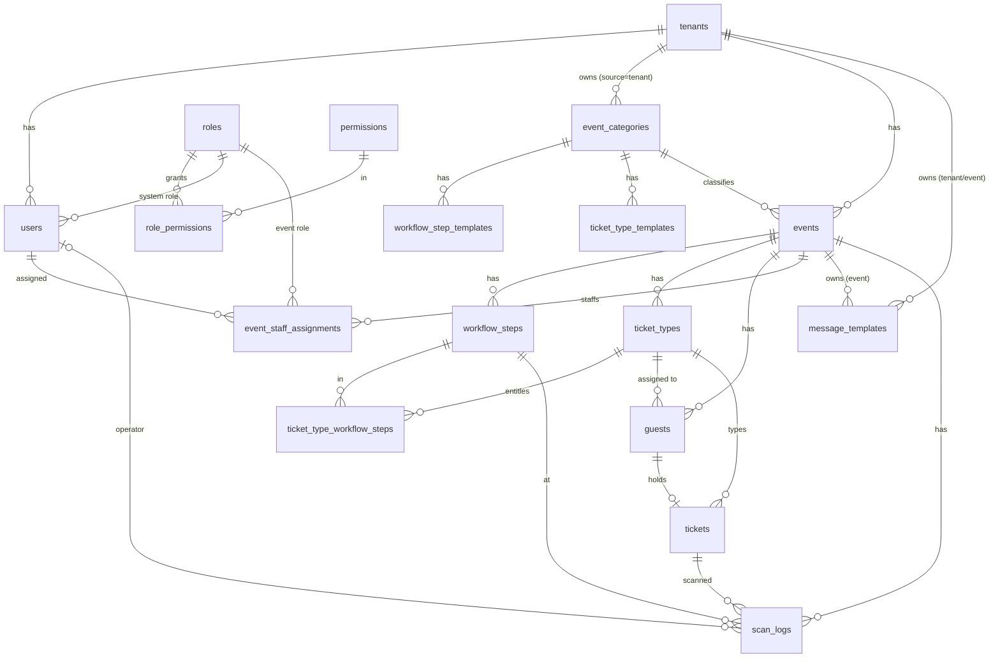

# Guest Management — Database Design

<!--
Extracted on 2026-09-17 from guest-management-be/migrations (000001–000019, the source of truth) and docs/DATABASE.md.
Where DATABASE.md and the SQL disagree, this document follows the SQL and says so.
-->

## Overview

The `guest-management-be` API owns one PostgreSQL database (default name `guest_management`). It covers multi-tenancy, roles and permissions, the three configuration layers (app → tenant → event), events, workflow steps, ticket types, guests, QR tickets, scans, and message templates. Migrations use golang-migrate (`make migration-up`). All primary keys are `UUID DEFAULT gen_random_uuid()`, and all timestamps are `TIMESTAMPTZ`. Enum-like columns are `VARCHAR` with `CHECK` constraints, mirrored by Go constants. Tenant isolation is enforced in the application, not in the database (ADR-002).

## Data Model

## Entities

Classification key: Internal, Confidential, PII, Secret.

### tenants

One customer organisation. There is also a reserved System tenant `00000000-0000-0000-0000-000000000001` (`type = 'system'`) that holds the Super Admin.

| Column | Type | Null | Default | Constraints | Classification | Description |
|--------|------|------|---------|-------------|----------------|-------------|
| id | uuid | No | gen_random_uuid() | PK | Internal | Primary key |
| name | text | No | — | — | Internal | Organisation name |
| type | text | Yes | — | — | Internal | Free-form type (`default`, `enterprise`, `system`) |
| settings | jsonb | Yes (DATABASE.md says No) | `'{}'` | — | Internal | Tenant configuration |
| branding | jsonb | Yes (DATABASE.md says No) | `'{}'` | — | Internal | Branding options |
| created_at, updated_at | timestamptz | No | now() | — | Internal | Audit timestamps |
| deleted_at | timestamptz | Yes | — | — | Internal | Soft-delete marker |

### permissions, roles, role_permissions

Reference data, with no soft delete. Changes are made only through migrations.

| Table.Column | Type | Null | Default | Constraints | Classification | Description |
|--------------|------|------|---------|-------------|----------------|-------------|
| permissions.id | uuid | No | gen_random_uuid() | PK | Internal | Primary key (seeded with fixed UUIDs) |
| permissions.code | varchar(32) | No | — | UNIQUE | Internal | `manage_tenants`, `manage_users`, `manage_events`, `manage_staff`, `manage_guests`, `manage_workflows`, `check_in` |
| permissions.name, description | text | No / Yes | — | — | Internal | Display name and description |
| roles.id | uuid | No | gen_random_uuid() | PK | Internal | Primary key (fixed UUIDs for the seeded roles) |
| roles.name | varchar(128) | No | — | — | Internal | Super Admin, Tenant Admin, Tenant Staff, Usher, Photobooth Staff |
| roles.description | text | Yes | — | — | Internal | Description |
| roles.scope | varchar(16) | No | — | CHECK in (`system`, `event`) | Internal | Where the role may be assigned |
| role_permissions.role_id, permission_id | uuid | No | — | Composite PK; FK with ON DELETE CASCADE | Internal | Grants |
| permissions/roles created_at, updated_at | timestamptz | No | now() | — | Internal | Audit timestamps |

### users

Staff accounts. Each user belongs to exactly one tenant and holds one system role.

| Column | Type | Null | Default | Constraints | Classification | Description |
|--------|------|------|---------|-------------|----------------|-------------|
| id | uuid | No | gen_random_uuid() | PK | Internal | Primary key and JWT `sub` |
| tenant_id | uuid | No | — | FK tenants ON DELETE CASCADE | Internal | Owning tenant; cannot change |
| email | text | No | — | UNIQUE (global, since 000012) | PII | Login email (stored in plaintext) |
| password_hash | text | No | — | — | Secret | bcrypt hash; never serialised |
| role_id | uuid | No | — | FK roles ON DELETE RESTRICT; the service requires a `system` role | Internal | System role |
| is_tenant_master | boolean | No | false | Partial UNIQUE (tenant_id) WHERE true | Internal | Tenant owner flag |
| must_change_password | boolean | No | true | — | Internal | Set true on create and on admin reset, false on self-service change |
| created_at, updated_at, deleted_at | timestamptz | — | now() / — | — | Internal | Audit and soft delete |

### event_categories

| Column | Type | Null | Default | Constraints | Classification | Description |
|--------|------|------|---------|-------------|----------------|-------------|
| id | uuid | No | gen_random_uuid() | PK | Internal | Primary key |
| source | varchar(32) | No | — | CHECK in (`app`, `tenant`) | Internal | Configuration layer |
| tenant_id | uuid | Yes | — | FK tenants ON DELETE CASCADE; `chk_app_tenant_id` | Internal | Null for app categories; required for tenant categories |
| name | text | No | — | — | Internal | Category name |
| created_at, updated_at, deleted_at | timestamptz | — | — | — | Internal | Audit and soft delete |

### workflow_step_templates

| Column | Type | Null | Default | Constraints | Classification | Description |
|--------|------|------|---------|-------------|----------------|-------------|
| id | uuid | No | gen_random_uuid() | PK | Internal | Primary key |
| category_id | uuid | No | — | FK event_categories ON DELETE CASCADE; UNIQUE (category_id, order_index) | Internal | Owning category |
| name | text | No | — | — | Internal | Step name |
| order_index | int | No | — | ≥ 0 (enforced by the service) | Internal | Position |
| allows_multiple | boolean | No | false | — | Internal | Repeatable step |
| ticket_type_applicability | jsonb | Yes | — | — | Internal | Opaque; not used in copying (ADR-008) |
| created_at, updated_at, deleted_at | timestamptz | — | — | — | Internal | Audit and soft delete |

### events

| Column | Type | Null | Default | Constraints | Classification | Description |
|--------|------|------|---------|-------------|----------------|-------------|
| id | uuid | No | gen_random_uuid() | PK | Internal | Primary key |
| tenant_id | uuid | No | — | FK tenants ON DELETE CASCADE | Internal | Owning tenant; cannot change |
| category_id | uuid | No | — | FK event_categories ON DELETE RESTRICT | Internal | Category |
| name | text | No | — | — | Internal | Event name |
| description | text | Yes | — | — | Internal | Description |
| start_date, end_date | timestamptz | No | — | end ≥ start (enforced by the service) | Internal | Schedule |
| is_multi_day | boolean | No | false | Derived by the service | Internal | Whether the event spans several calendar days |
| rsvp_required | boolean | No | true | — | Internal | Whether a ticket is issued on RSVP confirm (true) or when the invitation is sent (false) |
| created_at, updated_at, deleted_at | timestamptz | — | — | — | Internal | Audit and soft delete |

### workflow_steps

| Column | Type | Null | Default | Constraints | Classification | Description |
|--------|------|------|---------|-------------|----------------|-------------|
| id | uuid | No | gen_random_uuid() | PK | Internal | Primary key |
| event_id | uuid | No | — | FK events ON DELETE CASCADE; UNIQUE (event_id, order_index) | Internal | Owning event |
| name | text | No | — | — | Internal | Step name |
| order_index | int | No | — | Negative values are used temporarily during sync | Internal | Position |
| allows_multiple | boolean | No | false | — | Internal | Repeatable step |
| created_at, updated_at, deleted_at | timestamptz | — | — | — | Internal | Audit and soft delete |

### event_staff_assignments

| Column | Type | Null | Default | Constraints | Classification | Description |
|--------|------|------|---------|-------------|----------------|-------------|
| id | uuid | No | gen_random_uuid() | PK | Internal | Primary key |
| event_id | uuid | No | — | FK events ON DELETE CASCADE | Internal | Event; cannot change |
| user_id | uuid | No | — | FK users ON DELETE CASCADE; must be in the event's tenant (service) | Internal | Staff member; cannot change |
| role_id | uuid | No | — | FK roles ON DELETE RESTRICT; the service requires an `event` role | Internal | Event role; the only field that can be updated |
| created_at, updated_at, deleted_at | timestamptz | — | — | Partial UNIQUE (event_id, user_id) WHERE deleted_at IS NULL | Internal | Audit and soft delete; history is kept |

### ticket_types and ticket_type_templates

| Table.Column | Type | Null | Default | Constraints | Classification | Description |
|--------------|------|------|---------|-------------|----------------|-------------|
| ticket_types.id | uuid | No | gen_random_uuid() | PK | Internal | Primary key |
| ticket_types.event_id | uuid | No | — | FK events ON DELETE CASCADE; UNIQUE (event_id, name) | Internal | Owning event |
| ticket_types.name | text | No | — | — | Internal | For example VIP or Regular |
| ticket_types.rules | jsonb | Yes (DATABASE.md says No) | `'{}'` | — | Internal | Opaque rules; no schema defined yet |
| ticket_type_templates.id | uuid | No | gen_random_uuid() | PK | Internal | Primary key |
| ticket_type_templates.category_id | uuid | No | — | FK event_categories ON DELETE CASCADE; UNIQUE (category_id, name) | Internal | Owning category |
| ticket_type_templates.name | text | No | — | — | Internal | Name copied to the ticket type |
| ticket_type_templates.rules | jsonb | No | `'{}'` | — | Internal | Rules copied verbatim |
| both: created_at, updated_at, deleted_at | timestamptz | — | — | — | Internal | Audit and soft delete |

### ticket_type_workflow_steps

The steps each ticket type is entitled to. A junction table with no soft delete; it is replaced in full by `PUT .../workflow-steps`.

| Column | Type | Null | Default | Constraints | Classification | Description |
|--------|------|------|---------|-------------|----------------|-------------|
| ticket_type_id | uuid | No | — | Composite PK; FK ticket_types ON DELETE CASCADE | Internal | Ticket type |
| workflow_step_id | uuid | No | — | Composite PK; FK workflow_steps ON DELETE CASCADE; must be on the same event (service) | Internal | Workflow step |

### guests

| Column | Type | Null | Default | Constraints | Classification | Description |
|--------|------|------|---------|-------------|----------------|-------------|
| id | uuid | No | gen_random_uuid() | PK | Internal | Primary key |
| event_id | uuid | No | — | FK events ON DELETE CASCADE | Internal | Owning event; cannot change |
| name | text | No | — | — | PII | Plaintext so that partial search works (ADR-005) |
| email | text | No | — | — | PII (encrypted) | AES-256-GCM ciphertext |
| phone | text | Yes | — | — | PII (encrypted) | AES-256-GCM ciphertext |
| email_hash | text | Yes | — | Indexed | Confidential | HMAC-SHA256 of the lowercased, trimmed email |
| phone_hash | text | Yes | — | Indexed | Confidential | HMAC-SHA256 of the phone's digits |
| rsvp_status | varchar(32) | No | `'none'` | CHECK in (`none`, `invited`, `confirmed`, `declined`) | Internal | RSVP state |
| ticket_type_id | uuid | Yes | — | FK ticket_types ON DELETE SET NULL; must be on the same event (service) | Internal | Assigned type; required before an invitation is sent |
| invitation_token | text | Yes | — | UNIQUE | Secret | Unguessable RSVP token; the only credential for the public endpoint |
| ticket_id | uuid | Yes | — | FK tickets ON DELETE SET NULL | Internal | Issued ticket |
| created_at, updated_at, deleted_at | timestamptz | — | — | — | Internal | Audit and soft delete |

### tickets

| Column | Type | Null | Default | Constraints | Classification | Description |
|--------|------|------|---------|-------------|----------------|-------------|
| id | uuid | No | gen_random_uuid() | PK | Internal | Primary key |
| guest_id | uuid | No | — | FK guests ON DELETE CASCADE | Internal | Holder |
| event_id | uuid | No | — | FK events ON DELETE CASCADE; UNIQUE (event_id, qr_code) | Internal | Event |
| ticket_type_id | uuid | No | — | FK ticket_types ON DELETE RESTRICT | Internal | Type |
| qr_code | text | No | — | Unique per event | Confidential | Value encoded in the QR code; presented at scans |
| status | varchar(32) | No | `'active'` | CHECK in (`active`, `used`, `invalidated`) | Internal | Changes one way from `active` to `used` on the first successful scan; nothing sets `invalidated` yet |
| created_at, updated_at, deleted_at | timestamptz | — | — | — | Internal | Audit and soft delete |

### scan_logs

Append-only. No soft delete and no cache (ADR-007).

| Column | Type | Null | Default | Constraints | Classification | Description |
|--------|------|------|---------|-------------|----------------|-------------|
| id | uuid | No | gen_random_uuid() | PK | Internal | Primary key |
| event_id | uuid | No | — | FK events ON DELETE CASCADE | Internal | Event |
| ticket_id | uuid | No | — | FK tickets ON DELETE CASCADE | Internal | Scanned ticket |
| workflow_step_id | uuid | No | — | FK workflow_steps ON DELETE CASCADE | Internal | Step completed |
| scanned_at | timestamptz | No | now() | — | Internal | Scan time |
| operator_user_id | uuid | Yes | — | FK users ON DELETE SET NULL | Internal | Always NULL today; not populated |

### message_templates

| Column | Type | Null | Default | Constraints | Classification | Description |
|--------|------|------|---------|-------------|----------------|-------------|
| id | uuid | No | gen_random_uuid() | PK | Internal | Primary key |
| source | varchar(32) | No | — | CHECK in (`app`, `tenant`, `event`); `chk_message_template_source` | Internal | Configuration layer |
| tenant_id | uuid | Yes | — | FK tenants ON DELETE CASCADE | Internal | Required for tenant and event templates |
| event_id | uuid | Yes | — | FK events ON DELETE CASCADE | Internal | Required for event templates |
| name | varchar(128) | No | — | Partial UNIQUE per scope (see below) | Internal | For example Invitation or Thank you |
| channel | varchar(32) | No | — | CHECK in (`email`, `whatsapp`) | Internal | Delivery channel |
| subject | text | Yes | — | Required for email, empty for WhatsApp (service) | Internal | Email subject |
| body | text | No | — | — | Internal | Body with double-brace placeholders such as `guest_name` |
| variables | jsonb | Yes | — | — | Internal | Placeholder list |
| created_at, updated_at, deleted_at | timestamptz | — | — | — | Internal | Audit and soft delete |

## Relationships and Constraints

`ON DELETE` rules apply only to hard deletes. The application only soft-deletes, so cascades never fire in normal operation.

| Constraint | Tables | Rule | On delete |
|------------|--------|------|-----------|
| users → tenants | users.tenant_id | Every user has a tenant | CASCADE |
| users → roles | users.role_id | System role (service check) | RESTRICT |
| `users_email_key` | users | Email unique across all tenants | — |
| `idx_users_tenant_master` | users | At most one master per tenant | — |
| `idx_users_single_super_admin` | users | At most one user holds the Super Admin role | — |
| `chk_app_tenant_id` | event_categories | app ⇒ no tenant; tenant ⇒ tenant set | — |
| events → event_categories | events.category_id | A category can't be hard-deleted while events use it | RESTRICT |
| events, workflow_steps, ticket_types, guests, tickets, scan_logs, staff assignments → events | *.event_id | Children belong to one event | CASCADE |
| `UNIQUE (event_id, order_index)` / `(category_id, order_index)` | workflow_steps / workflow_step_templates | Unique position (not partial; soft-deleted rows still hold their slot) | — |
| `UNIQUE (event_id, name)` / `(category_id, name)` | ticket_types / ticket_type_templates | Unique name (not partial; a soft-deleted name can't be reused) | — |
| `idx_event_staff_assignments_event_user_active` | event_staff_assignments | One active assignment per user and event | — |
| guests.ticket_type_id | guests → ticket_types | Same event (service) | SET NULL |
| guests.ticket_id / tickets.guest_id | guests ↔ tickets | Circular one-to-one link | SET NULL / CASCADE |
| tickets.ticket_type_id | tickets → ticket_types | Type is required | RESTRICT |
| `UNIQUE (event_id, qr_code)` | tickets | QR code unique within an event | — |
| `chk_message_template_source` + 3 partial unique indexes | message_templates | Scope rules; unique (name, channel) per app, tenant, or event | — |

## Indexes and Performance

| Index | Table | Columns | Serves query | Type |
|-------|-------|---------|--------------|------|
| `idx_<table>_deleted_at` | every soft-delete table | deleted_at WHERE deleted_at IS NULL | Filtering active rows | partial btree |
| idx_events_tenant_start | events | tenant_id, start_date | Event lists per tenant | btree |
| idx_guests_event_rsvp | guests | event_id, rsvp_status | Guest list filtered by RSVP; planned B13 counts | btree |
| idx_guests_email_hash, idx_guests_phone_hash | guests | email_hash / phone_hash | Exact-match search | btree |
| idx_tickets_event_status | tickets | event_id, status | Tickets by event and status | btree |
| idx_scan_logs_ticket_step | scan_logs | ticket_id, workflow_step_id | Duplicate check in `RecordScan` | btree |
| idx_scan_logs_event_scanned | scan_logs | event_id, scanned_at | Scan history | btree |
| idx_roles_scope | roles | scope | Role scope lookup | btree |
| FK indexes | all child tables | *_id | Joins and nested lists | btree |

Data volumes are not known yet (PRD-001 Q1). `scan_logs` grows fastest, by roughly one row per scan per step per guest. Guest-name search uses `LIKE '%x%'` without a trigram index, which is accepted at current scale.

| Table | Rows today | Growth per month | Notes |
|-------|------------|------------------|-------|
| scan_logs | Not released | Not estimated | Consider partitioning by event or time at high volume |
| guests, tickets | Not released | Not estimated | — |

## Migrations and Backfill

| # | Migration | Locks / downtime | Reversible? |
|---|-----------|------------------|-------------|
| 000001–000010 | Create tenants, roles and permissions, users, categories and templates, events and steps, message templates, staff assignments, ticket types and junction, guests and tickets, scan logs | New tables only | Yes (down files) |
| 000011 | `idx_tickets_event_status` | Short lock during index build | Yes |
| 000012 | Email unique across all tenants instead of per tenant | Fails if duplicate emails exist across tenants | Yes |
| 000013 | `roles.scope NOT NULL` (safe because `roles` is empty at that point) | — | Yes |
| 000014 | Seed the System tenant, permissions, roles, and grants; single-Super-Admin index | First migration that seeds data; fixed UUIDs | Yes |
| 000015 | Staff assignment uniqueness becomes partial (active rows only) | — | Yes |
| 000016 | `events.rsvp_required DEFAULT true` | Backfills existing rows as true | Yes |
| 000017 | `guests.ticket_type_id`, `invitation_token`, `email_hash`, `phone_hash` plus indexes | Existing plaintext guest rows would need encrypting and hashing (use `cmd/piicli`) | Yes |
| 000018 | `users.must_change_password DEFAULT true` | Existing users are flagged | Yes |
| 000019 | Create `ticket_type_templates` | — | Yes |

New migrations are created with `make migration-create NAME=...`. Migrations must stay in sync with this document.

## Data Privacy and Retention

| Data | Purpose | Retention | Deletion method | Encrypted? |
|------|---------|-----------|-----------------|------------|
| Guest name | Guest list and search | Not defined (Q1) | Soft delete only | No (by design) |
| Guest email and phone | Invitations and lookup | Not defined (Q1) | Soft delete only | Yes, AES-256-GCM, plus HMAC index |
| Invitation token | Public RSVP access | Never expires | Soft delete of the guest | No |
| User email | Login | Account lifetime | Soft delete only | No |
| Password hash | Authentication | Account lifetime | Soft delete only | bcrypt hash |
| Scan logs | Check-in evidence and reports | Permanent | None | No |

Access: only the API service account. Staff see decrypted guest data through permission-gated endpoints. Keys are provided by `GUEST_PII_ENCRYPTION_KEY` and `GUEST_PII_BLIND_INDEX_KEY`.

## Backup and Recovery

Nothing has been defined yet. There is only a local docker volume (`postgres_data`).

| Item | Value |
|------|-------|
| Backup method and frequency | Not defined (Q2) |
| Retention | Not defined |
| RPO / RTO | Not defined |
| Last restore test | Never |

PII keys must be backed up separately from database backups. Without them, guest email and phone can't be recovered.

## Open Questions

| # | Question | Owner | Due | Blocking? |
|---|----------|-------|-----|-----------|
| Q1 | How long is guest data kept after an event, and should soft-deleted guest PII be purged or anonymised? | Bandana Irmal A | Before production | No |
| Q2 | What are the backup method, RPO/RTO, and key custody for production? | Bandana Irmal A | Before production | No |
| Q3 | Should `tenants.settings`, `tenants.branding`, and `ticket_types.rules` be made `NOT NULL` to match DATABASE.md and the service defaults? | Bandana Irmal A | Not set | No |
| Q4 | Should the unique constraints on names and order indexes (`ticket_types`, `ticket_type_templates`, `workflow_steps`, `workflow_step_templates`) become partial (`WHERE deleted_at IS NULL`) so that deleted names can be reused? | Bandana Irmal A | Not set | No |
| Q5 | Should invitation tokens expire? | Bandana Irmal A | Not set | No |
| Q6 | B10 (thank-you tracking, documentation links) and B14 (`incidents` table) will need new migrations. What are their schemas? | Bandana Irmal A | During B10/B14 design | No |
| Q7 | Should `scan_logs.operator_user_id` be populated now that `authz.UserIDFromContext` exists? | Bandana Irmal A | Not set | No |

<!-- relations:start — generated from the front matter by the platform; do not edit -->
## Relations

- **Satisfies:** [[PRD-001-guest-management-platform|PRD-001 · Guest Management Platform]]
- **Depends on:** [[ADR-002-enforce-tenant-isolation-in-the-application-layer|ADR-002 · Enforce tenant isolation in the application layer using the token's tenant claim]], [[ADR-004-use-one-role-engine-with-system-and-event-scopes|ADR-004 · Use one role and permission engine with system and event scopes and an event-scoped fallback]], [[ADR-005-encrypt-guest-contact-data-with-a-blind-index|ADR-005 · Encrypt guest email and phone at rest with AES-256-GCM and search them through an HMAC blind index]], [[ADR-007-soft-delete-entities-and-keep-scan-logs-append-only|ADR-007 · Soft-delete domain entities and keep scan logs append-only]], [[ADR-008-seed-events-from-category-templates-in-one-transaction|ADR-008 · Seed new events from category templates by copying them in one transaction]]
- **References:** [[ARCH-001-guest-management-architecture-overview|ARCH-001 · Guest Management — Architecture Overview]]
<!-- relations:end -->
