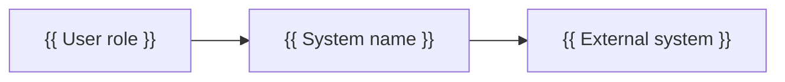
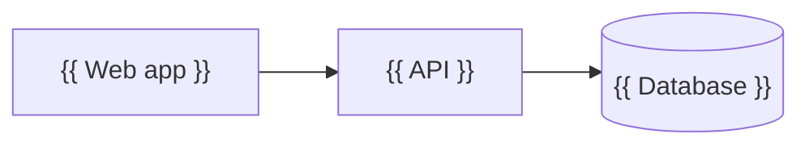

# {{ System name }} — Architecture Overview

<!--
Architecture Overview (based on arc42 and the C4 model)
Answers: how is the WHOLE system structured, and why? It is the entry point for any engineer
or client architect. Keep it current; feature-level detail belongs in Technical Designs.
Replace every {{ … }} placeholder. Diagrams may be Mermaid, PlantUML, or linked images.
-->

## Introduction and Goals

<!-- What the system does, its most important business goals, and the top 3–5 quality goals that drive the architecture. -->

**Purpose:** {{ What the system does and for whom }}

| Priority | Quality goal | Motivation |
|----------|--------------|------------|
| 1 | {{ e.g. Availability }} | {{ Why it matters }} |

## Constraints

<!-- Technical, organisational, and regulatory constraints the architecture must respect. -->

| Constraint | Type | Explanation |
|------------|------|-------------|
| {{ Constraint }} | {{ Technical / organisational / legal }} | {{ Explanation }} |

## System Context

<!-- C4 level 1: the system as one box, its users, and the external systems it talks to. -->

| Actor / external system | Interaction | Protocol |
|-------------------------|-------------|----------|
| {{ Name }} | {{ What is exchanged }} | {{ HTTPS / AMQP / … }} |

## Container View

<!-- C4 level 2: deployable/runnable units (web app, API, database, queue, workers) and how they communicate. -->

| Container | Technology | Responsibility | Repository |
|-----------|------------|----------------|------------|
| {{ Name }} | {{ Language / framework }} | {{ Responsibility }} | {{ repo name }} |

## Key Components

<!-- The most important modules inside the main containers, and their responsibilities. -->

| Component | Container | Responsibility |
|-----------|-----------|----------------|
| {{ Component }} | {{ Container }} | {{ Responsibility }} |

## Data and Integrations

<!-- Main data stores, data ownership, and integrations with external systems (direction, format, frequency, error handling). -->

| Integration | Direction | Format | Frequency | Failure handling |
|-------------|-----------|--------|-----------|------------------|
| {{ System }} | {{ In / out }} | {{ JSON / CSV / events }} | {{ Real-time / batch }} | {{ Retry / alert }} |

## Deployment View

<!-- Environments, hosting, network zones, and how containers map to infrastructure. Never include secrets. -->

| Environment | Hosting | URL / region | Notes |
|-------------|---------|--------------|-------|
| Production | {{ Provider / cluster }} | {{ URL / region }} | {{ Notes }} |
| Staging | {{ Provider }} | {{ URL }} | {{ Notes }} |

## Cross-Cutting Concerns

<!-- Approaches used everywhere: authentication and authorization, logging, monitoring, error handling, configuration, internationalisation, data protection. -->

| Concern | Approach |
|---------|----------|
| Authentication | {{ Approach }} |
| Authorization | {{ Approach }} |
| Logging and monitoring | {{ Approach }} |
| Error handling | {{ Approach }} |
| Configuration and secrets | {{ Approach (names only, no values) }} |

## Quality Attributes

<!-- Concrete, testable quality scenarios (stimulus → response → measure). -->

| Attribute | Scenario | Target |
|-----------|----------|--------|
| {{ Performance }} | {{ Under this load… }} | {{ …responds within }} |

## Architecture Decisions

<!-- Index of the significant ADRs. Add their IDs to `depends_on` in the front matter. -->

| ADR | Decision | Status |
|-----|----------|--------|
| {{ ADR-00X }} | {{ Short title }} | {{ Accepted / superseded }} |

## Risks and Technical Debt

| Item | Type | Impact | Plan |
|------|------|--------|------|
| {{ Item }} | {{ Risk / debt }} | {{ Impact }} | {{ Plan and timing }} |

## Glossary

| Term | Definition |
|------|------------|
| {{ Term }} | {{ Definition }} |
