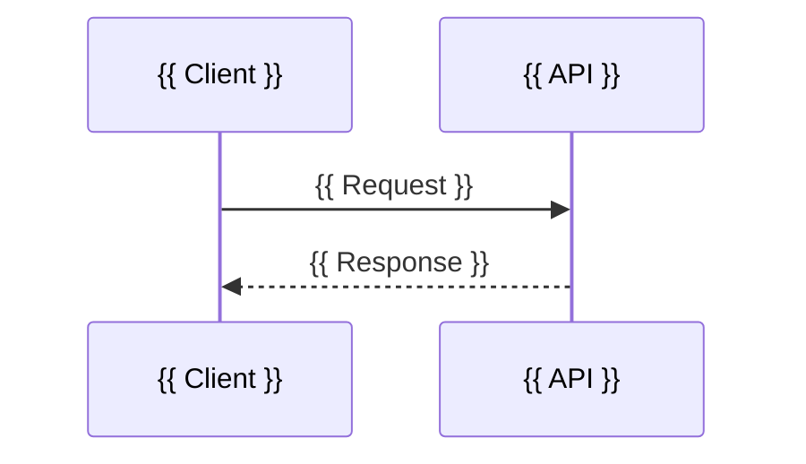

# {{ Feature name }} — Technical Design

<!--
Technical Design (also called Design Doc or RFC)
Answers: HOW will the system technically satisfy the requirements?
Prerequisite: the PRD in `satisfies` must be approved. Record significant decisions as ADRs
and list them in `depends_on`; list API / database designs this changes in `affects`.
Replace every {{ … }} placeholder.
-->

## Purpose

<!-- One paragraph: what this design delivers and why. -->

{{ What this design delivers. }}

## Requirements Addressed

<!-- Map every requirement in scope to the part of the design that satisfies it. Anything from the PRD not covered must be listed as out of scope with a reason. -->

| Requirement | How it is addressed | Section |
|-------------|---------------------|---------|
| {{ FR-01 }} | {{ Summary }} | {{ Proposed Solution }} |

**Out of scope:** {{ Requirements not covered, and why }}

## Proposed Solution

<!-- The design in prose: main flow, key algorithms, business rules, and how components interact. Use a sequence diagram for non-trivial flows. -->

{{ Description of the solution. }}

## Architecture

<!-- Components added or changed, where they live (repository/module), and how they fit the Architecture Overview. -->

| Component | Repository / module | Change | Responsibility |
|-----------|---------------------|--------|----------------|
| {{ Component }} | {{ repo/path }} | {{ New / changed }} | {{ Responsibility }} |

## Data Changes

<!-- New or changed tables, fields, indexes, events, and data migrations. Link the Database Design if one exists. Write "No data changes" if none. -->

{{ Data changes, or "No data changes". }}

## API Changes

<!-- New or changed endpoints, messages, or contracts, and whether they are backward compatible. Link the API Specification if one exists. -->

| Endpoint / contract | Change | Backward compatible? |
|---------------------|--------|----------------------|
| {{ METHOD /path }} | {{ New / changed / removed }} | {{ Yes / No — migration note }} |

## Failure Scenarios

<!-- What can fail (dependencies down, timeouts, bad input, concurrency, partial failure) and how the system behaves. -->

| Scenario | Detection | System behaviour | User impact |
|----------|-----------|------------------|-------------|
| {{ Scenario }} | {{ How we know }} | {{ Retry / fallback / error }} | {{ Impact }} |

## Security Considerations

<!-- Threats (STRIDE is a good checklist), authentication/authorization, input validation, data protection, secrets handling, audit logging, OWASP Top 10 exposure. -->

| Threat / concern | Mitigation |
|------------------|------------|
| {{ Threat }} | {{ Mitigation }} |

## Observability

<!-- Logs, metrics, traces, dashboards, and alerts needed to operate this feature. -->

| Signal | Name | Purpose | Alert threshold |
|--------|------|---------|-----------------|
| {{ Metric / log / trace }} | {{ Name }} | {{ Purpose }} | {{ Threshold or "none" }} |

## Alternatives Considered

<!-- At least one realistic alternative, with the reason it was not chosen. Significant choices become ADRs. -->

| Option | Pros | Cons | Why not chosen |
|--------|------|------|----------------|
| {{ Alternative }} | {{ Pros }} | {{ Cons }} | {{ Reason }} |

## Testing Strategy

<!-- How the design is verified: unit, integration, end-to-end, performance, security tests. Link the Test Plan if one exists. -->

| Level | What is tested | Tooling |
|-------|----------------|---------|
| Unit | {{ Scope }} | {{ Tool }} |
| Integration | {{ Scope }} | {{ Tool }} |

## Rollout and Migration

<!-- Feature flags, phased rollout, data migration order, backward compatibility window, and rollback approach. -->

1. {{ Rollout step }}

**Rollback:** {{ How to undo safely }}

## Open Questions

| # | Question | Owner | Due | Blocking? |
|---|----------|-------|-----|-----------|
| Q1 | {{ Question }} | {{ Owner }} | {{ Date }} | {{ Yes / No }} |
